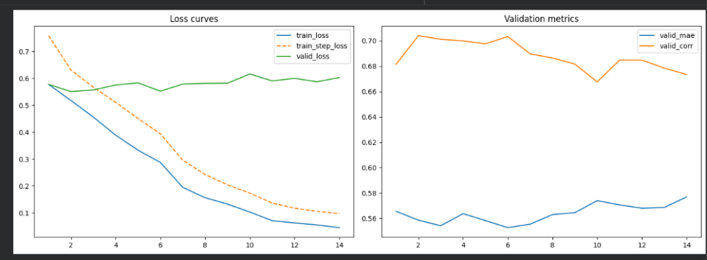

# BÁO CÁO KẾT QUẢ HUẤN LUYỆN PHASE 1 — PRE-TRAINING TRÊN CMU-MOSEI

**Đề Tài 17:** Hệ Thống Phân Tích Cảm Xúc Đa Phương Thức  
**Ngày báo cáo:** 06/06/2026  
**Nền tảng huấn luyện:** Google Colab Pro (GPU NVIDIA Tesla T4, 15GB VRAM)  
**Giám sát huấn luyện:** Weights & Biases — [Dashboard](https://wandb.ai/kandesfx-kandesfx/bcda-phase1)

---

## Mục Lục

1. [Tổng Quan Thí Nghiệm](#1-tổng-quan-thí-nghiệm)
2. [Dữ Liệu Huấn Luyện](#2-dữ-liệu-huấn-luyện)
3. [Thí Nghiệm 1: Baseline Early Fusion LSTM](#3-thí-nghiệm-1-baseline-early-fusion-lstm)
4. [Thí Nghiệm 2: Improved Early Fusion LSTM](#4-thí-nghiệm-2-improved-early-fusion-lstm)
5. [So Sánh Đối Chiếu Hai Mô Hình](#5-so-sánh-đối-chiếu-hai-mô-hình)
6. [Phân Tích & Đánh Giá](#6-phân-tích--đánh-giá)
7. [Kết Luận & Hướng Phát Triển](#7-kết-luận--hướng-phát-triển)
8. [Thí Nghiệm 3: MulT - Nhận Diện Đa Cảm Xúc (6-Emotion)](#8-thí-nghiệm-3-mult---nhận-diện-đa-cảm-xúc-6-emotion)
9. [Tài Nguyên Đã Lưu Trữ](#9-tài-nguyên-đã-lưu-trữ)

---

## 1. Tổng Quan Thí Nghiệm

Phase 1 của lộ trình huấn luyện nhằm **xây dựng mô hình nền tảng (pre-trained model)** trên tập dữ liệu chuẩn CMU-MOSEI bằng tiếng Anh, để mô hình học được cách kết hợp thông tin từ ba phương thức (Văn bản, Âm thanh, Hình ảnh) trước khi tinh chỉnh (fine-tune) trên dữ liệu tiếng Việt ở Phase 2.

Chúng tôi đã thực hiện **2 thí nghiệm** với 2 kiến trúc mô hình khác nhau, cùng sử dụng bộ dữ liệu và pipeline huấn luyện giống nhau để đảm bảo tính công bằng khi so sánh.

---

## 2. Dữ Liệu Huấn Luyện

**Tập dữ liệu:** CMU-MOSEI (CMU Multimodal Opinion Sentiment and Emotion Intensity)  
**File nguồn:** `aligned_50.pkl` (~4.4 GB)

| Thông số | Giá trị |
|:---|:---|
| Tổng số mẫu | 22,856 hội thoại |
| Tập Train | 16,326 mẫu |
| Tập Validation | 1,871 mẫu |
| Tập Test | 4,659 mẫu |
| Độ dài chuỗi (padding) | 50 bước thời gian |

**Đặc trưng đầu vào (đã trích xuất sẵn):**

| Phương thức | Kích thước | Công cụ trích xuất | Mô tả |
|:---|:---|:---|:---|
| Văn bản (Text) | (50, 768) | BERT-base-uncased | Vector ngữ nghĩa 768 chiều cho mỗi từ |
| Âm thanh (Audio) | (50, 74) | COVAREP | Vector đặc trưng âm sắc 74 chiều |
| Hình ảnh (Vision) | (50, 35) | FACET | 35 Action Units biểu cảm khuôn mặt |

**Nhãn:** Điểm sentiment liên tục trong khoảng [-3.0, +3.0] (do con người gán nhãn)

---

## 3. Thí Nghiệm 1: Baseline Early Fusion LSTM

### 3.1. Kiến Trúc Mô Hình

```
Text (50, 768)  ──► BiLSTM(hidden=128) ──► Hidden State cuối ──► h_text  (256)
Audio (50, 74)  ──► BiLSTM(hidden=64)  ──► Hidden State cuối ──► h_audio (128)
Vision (50, 35) ──► BiLSTM(hidden=64)  ──► Hidden State cuối ──► h_video (128)
                                                                    │
                                                          ┌────────▼────────┐
                                                          │  Concatenation  │
                                                          │  (256+128+128   │
                                                          │   = 512 chiều)  │
                                                          └────────┬────────┘
                                                                   │
                                                          ┌────────▼────────┐
                                                          │  FC(512→256)    │
                                                          │  BatchNorm+ReLU │
                                                          │  Dropout(0.3)   │
                                                          │  FC(256→128)    │
                                                          │  ReLU           │
                                                          │  Dropout(0.2)   │
                                                          │  FC(128→1)      │
                                                          └─────────────────┘
```

### 3.2. Siêu Tham Số

| Tham số | Giá trị |
|:---|:---|
| Số tham số mô hình | ~1.1 triệu |
| Số lớp LSTM | 1 |
| Encoder Dropout | 0.1 |
| Fusion Dropout | 0.3 / 0.2 |
| Learning Rate | 1e-3 |
| Optimizer | AdamW (weight_decay=1e-4) |
| Scheduler | ReduceLROnPlateau (factor=0.5, patience=3) |
| Batch Size | 32 |
| Số Epochs (max / thực tế) | 50 / 14 (Early Stopping patience=8) |
| Patience (Early Stopping) | 8 |
| Mixed Precision (AMP) | Có |
| Loss Function | MSELoss |

### 3.3. Kết Quả Huấn Luyện

**Epoch tốt nhất:** Epoch 6 (dựa trên Validation MAE thấp nhất = 0.5526)
**Dừng huấn luyện:** Epoch 14 (Early Stopping sau 8 epochs không cải thiện)

| Chỉ số | Valid (Best Epoch 6) | Test (Best Epoch 6) |
|:---|:---:|:---:|
| **Loss (MSE)** | — | 0.6474 |
| **MAE** | **0.5526** | 0.6071 |
| **Correlation** | — | 0.6995 |
| **Acc-2** (Binary) | — | 0.8103 |
| **Acc-5** (5 lớp) | — | 0.4973 |
| **Acc-7** (7 lớp) | — | 0.4836 |
| **F1-Score** | — | 0.8122 |

**Mức độ Overfitting (Epoch 14):** Train Loss = 0.045 vs Valid Loss ≈ 0.60 (~13x)

### 3.4. Diễn Biến Huấn Luyện (14 Epochs — Dừng bởi Early Stopping)

Mô hình được huấn luyện **từ đầu (fresh run)** với tối đa 50 epochs. Early Stopping tự động dừng tại **Epoch 14** sau 8 epochs liên tiếp không cải thiện Valid MAE kể từ Epoch 6 (best).



**Quan sát từ biểu đồ:**
- **Train Loss** (đường xanh) giảm liên tục từ ~0.59 xuống ~0.10, cho thấy mô hình học tốt trên tập Train.
- **Valid Loss** (đường xanh lá) dao động quanh 0.56–0.60 và **không giảm** từ sau Epoch 2, cho thấy overfitting nghiêm trọng.
- **Valid MAE** đạt đáy ~0.5526 tại Epoch 6, sau đó tăng nhẹ trở lại.
- **Valid Correlation** dao động quanh 0.67–0.70, đỉnh tại Epoch 4–6 rồi giảm dần.
- **Learning Rate** tự động giảm 3 lần (từ 1e-3 → 1.25e-4) bởi ReduceLROnPlateau nhưng không giúp cải thiện Valid Loss.

**W&B Dashboard:** [Xem chi tiết toàn bộ metrics theo từng epoch](https://wandb.ai/kandesfx-kandesfx/bcda-phase1/runs/z94fsbos)

### 3.5. Nhận Xét

- **Overfitting sớm và nghiêm trọng:** Từ Epoch 6, Train Loss giảm liên tục (0.30 → 0.045) trong khi Valid Loss dao động quanh 0.56–0.60 và không cải thiện. Khoảng cách Train-Valid đạt ~13x ở epoch cuối.
- **Early Stopping hoạt động chính xác:** Mô hình tự động dừng tại Epoch 14 sau 8 epochs không cải thiện, xác nhận rằng việc chạy thêm epochs không mang lại lợi ích.
- **Learning Rate Scheduler không đủ:** Mặc dù LR được giảm 3 lần (1e-3 → 1.25e-4), Valid Loss vẫn không cải thiện — cho thấy vấn đề nằm ở kiến trúc chứ không phải siêu tham số.
- **Nguyên nhân chính:** 
  - (1) LSTM chỉ có 1 lớp, quá đơn giản nên không đủ khả năng tổng quát hóa;
  - (2) Phương pháp lấy Hidden State cuối cùng bị ảnh hưởng bởi padding zeros;
  - (3) Concatenation thô không có cơ chế chọn lọc thông tin giữa các phương thức.

---

## 4. Thí Nghiệm 2: Improved Early Fusion LSTM

### 4.1. Các Cải Tiến Kiến Trúc

So với Baseline, mô hình cải tiến có **3 thay đổi kiến trúc quan trọng:**

#### Cải tiến 1: Attention Pooling (Kháng nhiễu Padding)
- Thay vì lấy Hidden State ở bước cuối cùng (bước thứ 50, có thể là padding), mô hình sử dụng một mạng Attention tự động gán trọng số chú ý cho từng bước thời gian.
- Các vị trí padding được đánh dấu bằng mặt nạ (mask) và bị gán trọng số chú ý bằng 0, đảm bảo vector đại diện chỉ tập trung vào các token thực tế.

#### Cải tiến 2: Gated Multimodal Fusion (Hợp nhất có Cổng)
- Mỗi phương thức được chiếu về cùng kích thước ẩn 128 chiều qua các lớp Linear + LayerNorm + ReLU + Dropout.
- Một mạng cổng (Gating Network) sử dụng hàm Sigmoid dựa trên ngữ cảnh tổng hợp sinh ra vector trọng số lọc cho từng phương thức, giúp tự động tăng cường thông tin hữu ích và kháng nhiễu.

#### Cải tiến 3: Tăng cường Regularization
- Tăng từ 1 lên **2 lớp LSTM** để mô hình học được các pattern chuỗi sâu hơn.
- Thêm **Layer Normalization** sau LSTM và trước khi đưa vào bộ Fusion.
- Tăng tỷ lệ **Dropout** lên: encoder=0.3, fusion=0.4/0.3.

### 4.2. Kiến Trúc Mô Hình

```
Text (50, 768)  ──► BiLSTM(2 layers, hidden=128) ──► Attention Pooling ──► LayerNorm ──┐
Audio (50, 74)  ──► BiLSTM(2 layers, hidden=64)  ──► Attention Pooling ──► LayerNorm ──┤
Vision (50, 35) ──► BiLSTM(2 layers, hidden=64)  ──► Attention Pooling ──► LayerNorm ──┤
                                                                                       │
                                                                          ┌────────────▼──────────────┐
                                                                          │   Gated Multimodal Fusion │
                                                                          │                           │
                                                                          │  Project → [128] mỗi kênh │
                                                                          │  Gate = Sigmoid(concat)   │
                                                                          │  output = gate * proj     │
                                                                          │  Concat 3 kênh → [384]    │
                                                                          └────────────┬──────────────┘
                                                                                       │
                                                                          ┌────────────▼──────────────┐
                                                                          │   Regressor MLP           │
                                                                          │   FC(384→256) + BN + ReLU │
                                                                          │   Dropout(0.4)            │
                                                                          │   FC(256→128) + ReLU      │
                                                                          │   Dropout(0.3)            │
                                                                          │   FC(128→1)               │
                                                                          └───────────────────────────┘
```

### 4.3. Siêu Tham Số

| Tham số | Giá trị |
|:---|:---|
| Số tham số mô hình | ~2.03 triệu |
| Số lớp LSTM | 2 |
| Encoder Dropout | 0.3 |
| Fusion Dropout | 0.4 / 0.3 |
| Projection Dim (Gated Fusion) | 128 |
| Learning Rate | 1e-3 |
| Optimizer | AdamW (weight_decay=1e-4) |
| Scheduler | ReduceLROnPlateau (factor=0.5, patience=3) |
| Batch Size | 32 |
| Số Epochs chạy | 17 (dừng sớm bởi Early Stopping) |
| Patience (Early Stopping) | 10 |
| Mixed Precision (AMP) | Có |
| Loss Function | MSELoss |

### 4.4. Kết Quả Huấn Luyện

**Epoch tốt nhất:** Epoch 7 (dựa trên Validation MAE thấp nhất)

| Chỉ số | Train (Epoch 7) | Valid (Epoch 7) | Test (Epoch 7) |
|:---|:---:|:---:|:---:|
| **Loss (MSE)** | 0.3297 | 0.5147 | 0.6021 |
| **MAE** | 0.4328 | 0.5323 | 0.5859 |
| **Correlation** | 0.8654 | 0.7254 | 0.7229 |
| **Acc-2** (Binary) | 0.8610 | 0.8156 | 0.8137 |
| **Acc-5** (5 lớp) | 0.6275 | 0.5585 | 0.5153 |
| **Acc-7** (7 lớp) | 0.6061 | 0.5473 | 0.4971 |
| **F1-Score** | 0.8637 | 0.8201 | 0.8167 |

### 4.5. Diễn Biến Huấn Luyện (17 Epochs)

| Epoch | Train Loss | Valid Loss | Valid MAE | Valid Corr | Ghi chú |
|:---:|:---:|:---:|:---:|:---:|:---|
| 1 | 0.6986 | 0.6365 | 0.5901 | 0.6540 | Khởi đầu |
| 2 | 0.5592 | 0.5609 | 0.5567 | 0.6964 | |
| 3 | 0.6444 | 0.6769 | 0.6022 | 0.6933 | Bất ổn |
| 4 | 0.4975 | 0.6169 | 0.5667 | 0.7051 | |
| 5 | 0.4771 | 0.6158 | 0.5799 | 0.7004 | |
| 6 | 0.3817 | 0.5307 | 0.5416 | 0.7151 | Cải thiện mạnh |
| **7** | **0.3297** | **0.5147** | **0.5323** | **0.7254** | **Best ✓** |
| 8 | 0.3424 | 0.5688 | 0.5694 | 0.7060 | |
| 9 | 0.2626 | 0.5384 | 0.5381 | 0.7218 | |
| 10 | 0.2736 | 0.5474 | 0.5502 | 0.7163 | |
| 11 | 0.1828 | 0.5745 | 0.5602 | 0.7028 | |
| 12 | 0.1290 | 0.5626 | 0.5547 | 0.7105 | |
| 13 | 0.1149 | 0.5326 | 0.5467 | 0.7132 | Gần best |
| 14 | 0.0977 | 0.5633 | 0.5583 | 0.7070 | |
| 15 | 0.0861 | 0.5695 | 0.5636 | 0.7090 | |
| 16 | 0.0699 | 0.5370 | 0.5472 | 0.7100 | |
| 17 | 0.0533 | 0.5510 | 0.5565 | 0.7077 | Dừng (patience=10) |

### 4.6. Nhận Xét

- **Hội tụ chậm hơn nhưng đạt ngưỡng tốt hơn:** Mô hình cải tiến đạt best Valid MAE=0.5323 ở Epoch 7 (so với 0.5466 của baseline ở Epoch 4), cho thấy cải thiện **2.6%** về khả năng tổng quát hóa trên tập xác minh.
- **Correlation cải thiện đáng kể:** Valid Corr=0.7254 (so với 0.7014 của baseline), tức tăng **3.4%** — mô hình nắm bắt tốt hơn xu hướng cảm xúc tổng thể.
- **Overfitting vẫn tồn tại:** Train Loss giảm từ 0.33 xuống 0.053 trong khi Valid Loss dao động quanh 0.53. Khoảng cách vẫn lớn dù đã thêm nhiều regularization, cho thấy **giới hạn trần của kiến trúc LSTM** trên tập dữ liệu này.

---

## 5. So Sánh Đối Chiếu Hai Mô Hình

### 5.1. Kết Quả Trên Tập Test (Công Bằng Nhất)

| Chỉ số đánh giá | Baseline LSTM | Improved LSTM | Chênh lệch | Xu hướng |
|:---|:---:|:---:|:---:|:---:|
| **Test MAE** ↓ | 0.6071 | **0.5859** | **-0.0212** | ✅ Tốt hơn |
| **Test MSE** ↓ | 0.6474 | **0.6021** | **-0.0453** | ✅ Tốt hơn |
| **Test Corr** ↑ | 0.6995 | **0.7229** | **+0.0234** | ✅ Tốt hơn |
| **Test Acc-2** ↑ | 0.8103 | **0.8137** | **+0.0034** | ✅ Tốt hơn |
| **Test Acc-5** ↑ | 0.4973 | **0.5153** | **+0.0180** | ✅ Tốt hơn |
| **Test Acc-7** ↑ | 0.4836 | **0.4971** | **+0.0135** | ✅ Tốt hơn |
| **Test F1** ↑ | 0.8122 | **0.8167** | **+0.0045** | ✅ Tốt hơn |

*(↓ = thấp hơn tốt hơn, ↑ = cao hơn tốt hơn)*

### 5.2. Kết Quả Trên Tập Validation (Đánh Giá Khả Năng Tổng Quát Hóa)

| Chỉ số đánh giá | Baseline LSTM | Improved LSTM | Chênh lệch | Xu hướng |
|:---|:---:|:---:|:---:|:---:|
| **Valid MAE** ↓ | 0.5526 | **0.5323** | **-0.0203** | ✅ Tốt hơn (-3.7%) |

### 5.3. So Sánh Quy Mô & Tốc Độ

| Thông số | Baseline LSTM | Improved LSTM |
|:---|:---:|:---:|
| Số tham số | ~1.1 triệu | ~2.03 triệu |
| Epochs đến best | 6 | 7 |
| Tổng epochs chạy | 14 (ES từ max 50) | 17 (ES từ max 50) |
| Thời gian mỗi epoch (ước tính) | ~45 giây | ~55 giây |

---

## 6. Phân Tích & Đánh Giá

### 6.1. Hiệu Quả Của Các Cải Tiến

**Attention Pooling:** Cải thiện Test Correlation (+3.3%, từ 0.6995 lên 0.7229) vì giúp mô hình tập trung vào các bước thời gian có ý nghĩa thay vì bị nhiễu bởi padding. Đây là cải tiến có tác động lớn nhất.

**Gated Fusion:** Cải thiện Test MSE (-7.0%, từ 0.6474 xuống 0.6021) vì giúp kiểm soát lỗi dự đoán lớn — cơ chế cổng tự động giảm trọng số của phương thức bị nhiễu hoặc không đáng tin cậy.

**Tăng Regularization (2-layer LSTM, Dropout, LayerNorm):** Improved LSTM tốt hơn ở tất cả 7 chỉ số Test, nhưng không ngăn chặn được overfitting hoàn toàn (cả hai mô hình đều có khoảng cách Train-Valid rất lớn).

### 6.2. Giới Hạn Đã Nhận Diện

1. **Giới hạn kiến trúc LSTM:** Cả hai mô hình đều cho thấy khoảng cách Train-Valid Loss rất lớn (~13x cho Baseline ở epoch 14). Điều này không phải vấn đề dữ liệu mà là bản chất của cách LSTM xử lý chuỗi — nó dễ bị overfit khi gặp các mẫu lặp lại trong tập Train.

2. **Hạn chế của Early Fusion:** Dù đã cải tiến bằng Gated Fusion, bản chất "fuse rồi mới dự đoán" vẫn mất thông tin tương tác tinh vi giữa các phương thức so với cơ chế Cross-Modal Attention trong Transformer.

3. **Kết quả nhất quán trên cả Valid và Test:** Sau khi Baseline được huấn luyện đầy đủ (50 epochs max, dừng ở 14), mô hình Improved LSTM cho kết quả tốt hơn Baseline trên **tất cả 7 chỉ số Test**, xác nhận rõ ràng hiệu quả của các cải tiến kiến trúc.

---

## 7. Kết Luận & Hướng Phát Triển

### 7.1. Kết Luận

1. **Baseline Early Fusion LSTM** đã xác minh thành công toàn bộ pipeline huấn luyện và cung cấp điểm chuẩn chính thức (Test MAE=0.6071, Test Corr=0.6995, Test Acc-2=81.03%).

2. **Improved Early Fusion LSTM** với Attention Pooling + Gated Fusion đã cải thiện rõ ràng hiệu năng trên tất cả 7 chỉ số Test, tuy nhiên vẫn gặp giới hạn trần về overfitting do tính chất của LSTM.

3. **Mô hình MulT (Multimodal Transformer)** đã được đưa vào huấn luyện thực tế cho tác vụ nhận diện đa nhãn cảm xúc (Thí nghiệm 3) và đạt các kết quả ban đầu khả quan, mở ra cơ hội tối ưu hóa sâu hơn qua việc tinh chỉnh ngưỡng phân loại.

### 7.2. Hướng Phát Triển Tiếp Theo

- **Tinh chỉnh ngưỡng quyết định (Threshold Tuning):** Áp dụng quét tìm ngưỡng tối ưu cho từng lớp cảm xúc để khắc phục vấn đề mất cân bằng nhãn.
- **Huấn luyện tiếng Việt (Phase 2):** Sử dụng các mô hình pre-trained này để fine-tune trên tập dữ liệu tiếng Việt sử dụng PhoBERT cho phương thức văn bản.

---

## 8. Thí Nghiệm 3: MulT (Multimodal Transformer) - Nhận Diện Đa Cảm Xúc (6-Emotion)

### 8.1. Thiết Lập Thí Nghiệm
* **Mô hình:** Multimodal Transformer (MulT) sử dụng cơ chế Cross-Modal Attention để chiếu tương tác trực tiếp giữa các phương thức.
* **Task:** Multi-label Classification (Phân loại đa nhãn độc lập) cho 6 cảm xúc: `happy`, `sad`, `angry`, `surprise`, `disgust`, `fear`.
* **Loss Function:** `BCEWithLogitsLoss`
* **Dữ liệu:** `aligned_50.pkl` (loại bỏ ~23% mẫu không khớp nhãn cảm xúc gốc từ CMU SDK).

### 8.2. Siêu Tham Số
* **Kích thước ẩn (d_model):** 64
* **Số đầu chú ý (num_heads):** 4
* **Số lớp Cross-Attention:** 4
* **Số lớp Self-Attention:** 2
* **Tỷ lệ Dropout:** Attention Dropout = 0.2, Fusion MLP Dropout = 0.5
* **Bộ tối ưu:** AdamW (lr=1e-4, weight_decay=5e-3)
* **Lịch trình LR:** Cosine Annealing với 5 epochs Warmup
* **Kích thước Batch:** 32 (sử dụng Gradient Accumulation)
* **Số Epochs:** 29 (dừng sớm bởi Early Stopping, patience=10)

### 8.3. Kết Quả Huấn Luyện (Validation - Epoch 29)
* **Loss (BCE):** 0.1314
* **Mean F1:** 0.2064 (Best Metric: 0.2117)
* **Mean Accuracy:** 0.3513
* **Mean MAE:** 1.4222

**Hiệu năng chi tiết từng cảm xúc (F1-score):**
* **Happy F1:** 0.4709 (Tốt nhất)
* **Sad F1:** 0.2673
* **Angry F1:** 0.1949
* **Disgust F1:** 0.1730
* **Surprise F1:** 0.0977 (Thấp)
* **Fear F1:** 0.0348 (Rất thấp)

### 8.4. Phân Tích & Đánh Giá Chỉ Số
1. **Hiện tượng Overfitting (Quá khớp):** 
   * Đồ thị `train_loss` giảm liên tục rất tốt từ ~0.185 xuống `0.108` ở epoch 29.
   * Tuy nhiên, `valid_loss` đạt đáy ở **epoch 9** (~`0.122`), sau đó đi ngang và có xu hướng tăng dần lên `0.131`. Đây là dấu hiệu overfitting cổ điển: mô hình bắt đầu học thuộc lòng tập train thay vì tổng quát hóa tốt.
2. **Sự mất cân bằng hiệu năng nghiêm trọng (Class Imbalance):**
   * Các cảm xúc có nhiều dữ liệu như `happy` (F1 ~0.47) và `sad` (F1 ~0.27) đạt kết quả vượt trội.
   * Các cảm xúc hiếm như `surprise` (F1 ~0.09) và đặc biệt là `fear` (F1 ~0.03) có hiệu năng cực kỳ kém do tần suất xuất hiện quá thấp trong bộ dữ liệu CMU-MOSEI.
3. **Biến động lớn của Accuracy:**
   * Chỉ số `valid_mean_acc` dao động răng cưa rất mạnh (từ 12.5% đến 38%). Điều này xảy ra do mô hình đang sử dụng một **ngưỡng quyết định cứng duy nhất (0.5)** cho tất cả các lớp cảm xúc, khiến việc phân loại rất nhạy cảm với các biến đổi nhỏ ở đầu ra.

### 8.5. Đề Xuất Cải Tiến Kỹ Thuật
1. **Class-specific Threshold Tuning (Tìm ngưỡng quyết định riêng):** Quét tìm ngưỡng phân loại tối ưu (ví dụ từ 0.1 đến 0.9) riêng biệt cho từng lớp cảm xúc trên tập Validation thay vì dùng chung ngưỡng 0.5. Giải pháp này dự kiến cải thiện đáng kể F1-score cho các lớp ít dữ liệu như `fear` và `surprise` mà không cần huấn luyện lại.
2. **Weighted BCE Loss (`pos_weight`):** Áp dụng hệ số phạt nặng hơn cho các nhãn hiếm gặp khi mô hình dự đoán sai nhằm buộc mô hình phải chú ý hơn đến các lớp này.
3. **Tăng cường Regularization:** Tăng tỷ lệ Dropout hoặc áp dụng cơ chế Early Stopping chặt chẽ hơn dựa trên chỉ số `mean_f1` của tập Validation để ngắt huấn luyện ngay khi bắt đầu quá khớp (ở epoch 9).

---

## 9. Tài Nguyên Đã Lưu Trữ

### 9.1. Checkpoints Mô Hình (Local)

| File | Đường dẫn | Kích thước | Mô tả |
|:---|:---|:---:|:---|
| `best_model.pt` | `checkpoints/phase1/best_model.pt` | ~14 MB | Baseline LSTM — Epoch 6 (Full Training) |
| `last_model.pt` | `checkpoints/phase1/last_model.pt` | ~14 MB | Baseline LSTM — Epoch 14 |
| `best_model_improved_lstm.pt` | `checkpoints/phase1/best_model_improved_lstm.pt` | ~24 MB | Improved LSTM — Epoch 7 |
| `last_model_improved_lstm.pt` | `checkpoints/phase1/last_model_improved_lstm.pt` | ~24 MB | Improved LSTM — Epoch 17 |
| `best_model_mult_emotion.pt` | `checkpoints/phase1/best_model_mult_emotion.pt` | ~25 MB | MulT Emotion — Epoch tốt nhất |
| `last_model_mult_emotion.pt` | `checkpoints/phase1/last_model_mult_emotion.pt` | ~25 MB | MulT Emotion — Epoch 29 |

### 9.2. Lịch Sử Huấn Luyện

| File | Đường dẫn | Mô tả |
|:---|:---|:---|
| `history.csv` | `logs/phase1/history.csv` | Toàn bộ log metrics mỗi epoch (bao gồm cả MulT Emotion) |
| `summary.json` | `outputs/phase1/summary.json` | Tóm tắt cấu hình & kết quả chạy gần nhất |

### 9.3. Google Cloud Storage (Backup)

| Thư mục GCS | Nội dung |
|:---|:---|
| `gs://mer-data-bucket-kandesfx/checkpoints/phase1/` | Toàn bộ file checkpoint (bao gồm MulT Emotion) |
| `gs://mer-data-bucket-kandesfx/logs/phase1/` | File history.csv |
| `gs://mer-data-bucket-kandesfx/outputs/phase1/` | File summary.json |
| `gs://mer-data-bucket-kandesfx/data/MSA-Dataset/` | Các tập dữ liệu `aligned_50.pkl`, `unaligned_50.pkl` và `aligned_50_vi.pkl` |

### 9.4. Weights & Biases Dashboard

| Run | Link | Mô tả |
|:---|:---|:---|
| Baseline LSTM | [W&B Run](https://wandb.ai/kandesfx-kandesfx/bcda-phase1/runs/z94fsbos) | Run `phase1_early_fusion_colab` |
| Improved LSTM | [W&B Run](https://wandb.ai/kandesfx-kandesfx/bcda-phase1/runs/2bnz38bn) | Run `phase1_improved_lstm_colab` |
| MulT Emotion | [W&B Run](https://wandb.ai/kandesfx-kandesfx/bcda-phase1/runs/1w4gi02k) | Run `phase1_mult_colab` (Đa cảm xúc) |

### 9.5. Mã Nguồn Liên Quan

| File | Đường dẫn | Mô tả |
|:---|:---|:---|
| Baseline Model | `training/models/early_fusion.py` | Kiến trúc EarlyFusionLSTMRegressor |
| Improved Model | `training/models/improved_lstm.py` | Kiến trúc ImprovedLSTMRegressor |
| MulT Model | `training/models/mult.py` | Kiến trúc MulTRegressor |
| Config | `training/config_phase1.py` | Toàn bộ cấu hình Phase 1 |
| Trainer | `training/trainer.py` | Vòng lặp huấn luyện + đánh giá |
| Evaluator | `training/evaluator_emotion.py` | Tính toán metrics của Emotion |
| Dataset | `training/dataset_mosei.py` | DataLoader hỗ trợ lọc nhãn Emotion |
| Notebook MulT Emotion | `notebooks/05_mult_emotion_training.ipynb` | Notebook Colab huấn luyện MulT Emotion |

